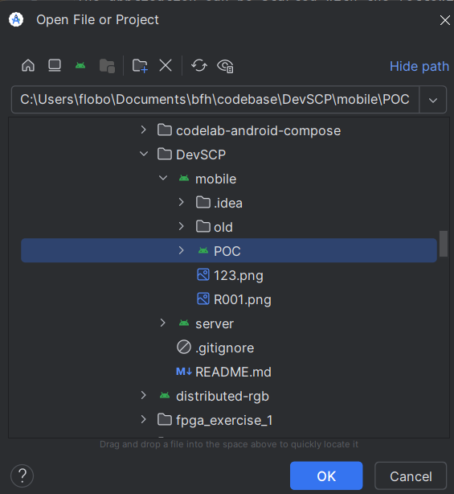
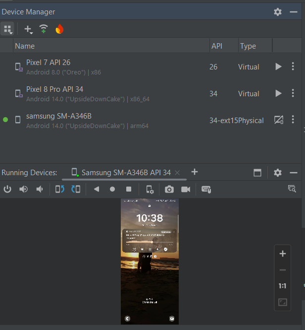
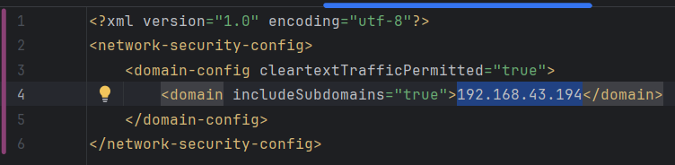
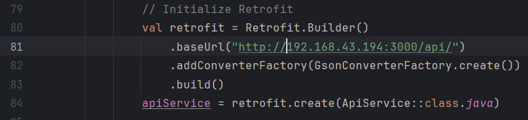
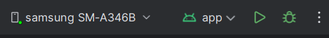
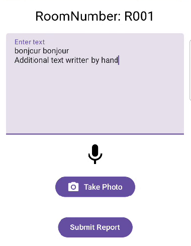
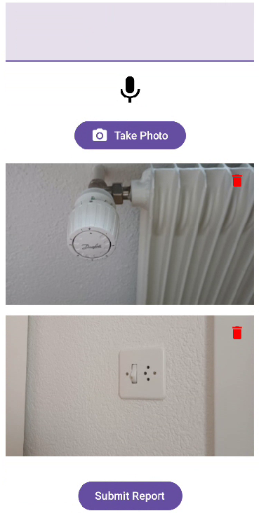
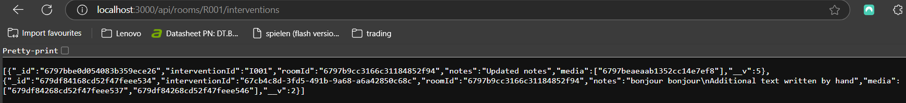
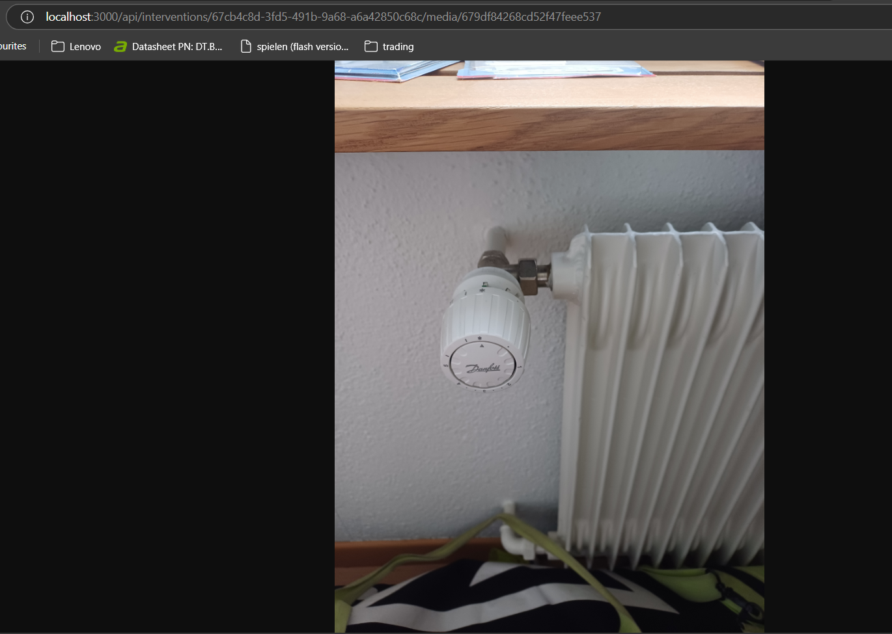

# Starting the mobile android application
The application can be started with the following steps:
1. Connecting your mobile phone correctly with android studio
2. Let the APP run!
3. Replay our demo!

Hint: The app is not yet optimized for dark mode -> enter light mode to see the microphone button and other items properly.

## Connection to android studio
In this guide we are using a physical phone to test the application.
1. Download Android Studio (minimval version required: Ladybug)
2. Open android studio and open the project. The app is located under mobile/POC. See image:

3. Put your android phone into developer mode, enable USB-Debugging and connect it to your PC with an USB cable
4. On your phone, allow the USB Debugging connection if requested

You should now be able to see your mobile phone in the devices on android studio.
 
In case you want to use a virtual device, check the android studio documentation to see how you can enable a virtual device. Keep in mind, that virtual devices can be a bit buggy from time to time and the emulator stuggles sometimes!
 
You should have your physical phone listed under the devcice manager and see a mirrored screen of your phone in the running devices: 

## Let the APP run
In the upper middle of android studio you can see your selected device and the selected app.  
Before you can use the app, ensure the backend is up and running and ensure that the server your backend is running on is in the same network as your mobile device. You can achieve this simply be using your home network or a mobile hotspot. 
To start the backend, follow the respective backend guide. Please ensure as well, that the Room (R001) exists in the database!
Now follow these steps:
1. Adjust the IP-Address in the code to match your servers IP-Address. This needs to be done in two files:
    - network_security_config.xml  
    - In addition, the file FormActivity.kt needs to be adjusted in the initialization of retrofit. 
2. Select the application correctly in the top middle and select your physical mobile device 
3. Press the play button in order to compile and launch the app on your mobile device. 

## Replay our demo
By the above step, the app started and is now on your mobile device. 
Attention: Allow the app to access the camera if asked. Otherwise the app won't work!
  
Once the app is started and the permission is given, you enter directly the "Scanning" mode. 
Scan this QR Code of room R001

 
This creates a new intervention!  
Allow the app to access your microphone to use the speech-to-text feature!  
You can enter a text into the textfield by hand or by keeping the microphone icon in the middle of the screen pressed. You can also use both practices!  
 
By pressind the "take photo" button you can add multiple pictures to your report.

Images can be deleted by pressing the trash bin icon.  
The final step is submitting the report. This is done by pressing the "submit report" button. This is where you can still see that the project is in a POC-State. Give the app a seconds to send the data to the backend before closing the app!  
By using the routes provided by our backend, you can see that the intervention has been added to the room (/api/rooms/R001/interventions):

So in the JSON-response you can see the new invervention with a new interventionId, the text and the media reference. An Endpoint (api/interventions/\<interventionId\>/media/\<mediaId\>) allows you to display your images:

More endpoints are described in the server!